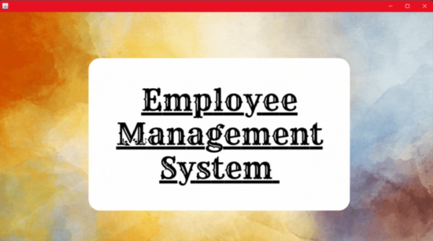
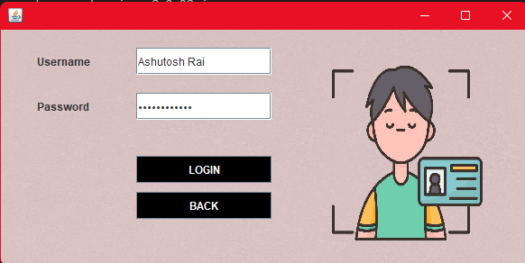
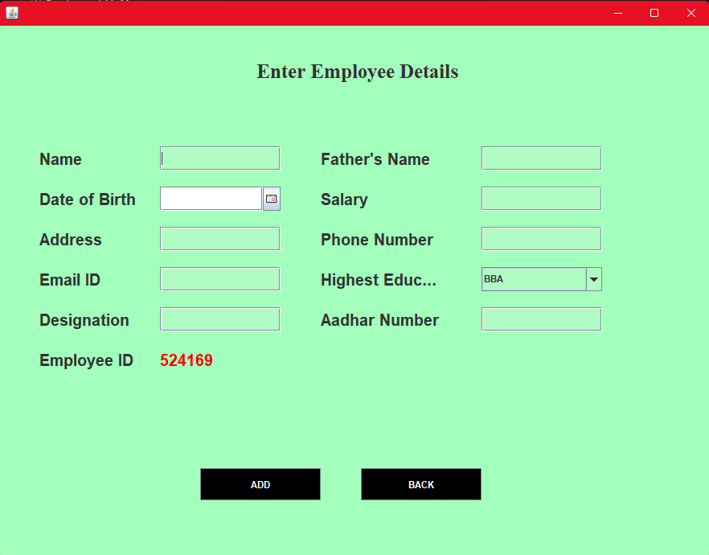
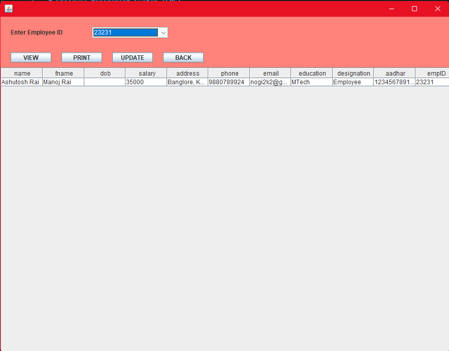
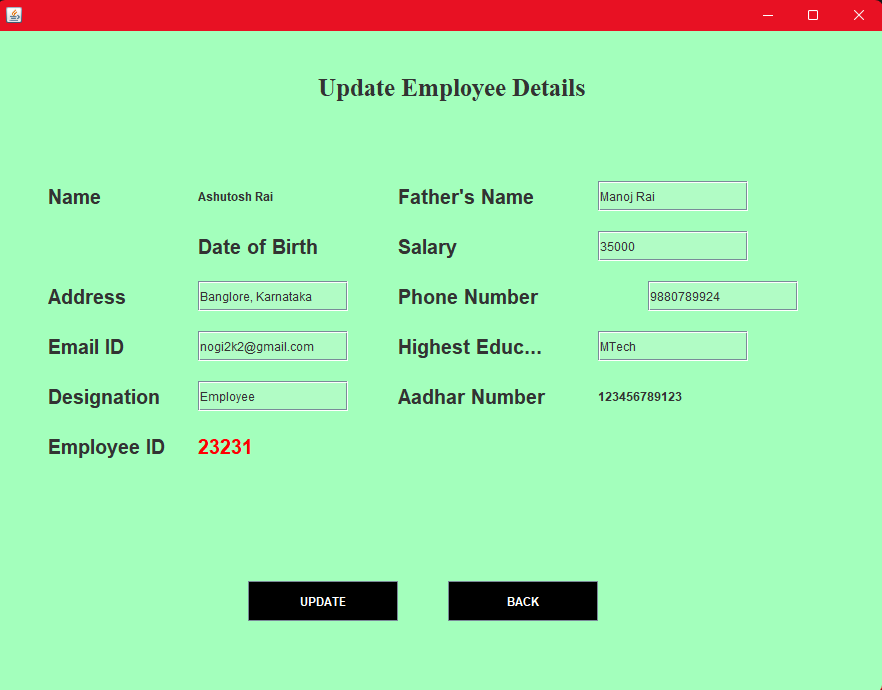
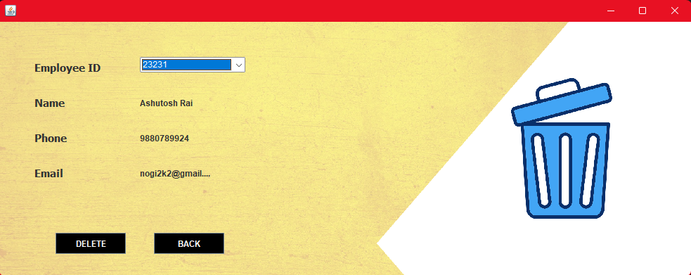

# Employee Management System (EMS)

A simple Java based Employee Management System that allows you to manage employee records - adding, viewing, updating, and removing employees.
This system connects to a MySQL database and provides a user-friendly interface built using Swing.

---

## 📋 Features

- 🔐 **Login Authentication**
- 🌟 **Splash Screen** at startup
- ➕ **Add Employee** with details like name, father's name, salary, address, etc.
- 📄 **View All Employees** in a table
- 🔍 **Search Employee** by ID
- 🖨️ **Print Employee Records**
- 📝 **Update Employee Details**
- ❌ **Remove Employee**
- ⏪ **Back Navigation to Main Dashboard**

---

## Tech Stack

- **Java (JDK 8+)** – Core backend and GUI logic
- **Java Swing** – GUI framework 
- **Java AWT** – Event Handling
- **MySQL** – Database for employee and login records
- **MySQL JDBC Driver** – JDBC connector 
- **Git** – Version control 

---

## Project Structure

```
│── src
│   ├── assets
│   ├── employee
│   |   ├── management
│   |   |   ├── system
│   |   |   |   ├── Splash.java                # Splash screen displayed on startup
│   |   |   |   ├── Login.java                 # Login screen with authentication
│   |   |   |   ├── MainClass.java             # Launches the dashboard
│   |   |   |   ├── AddEmployee.java           # GUI and logic for adding a new employee
│   |   |   |   ├── ViewEmployee.java          # GUI to view all employees in a table
│   |   |   |   ├── RemoveEmployee.java        # GUI to remove employee by ID
│   |   |   |   ├── UpdateEmployee.java        # GUI to update employee records
│   |   |   |   ├── Conn.java                  # Database connection class (MySQL)
│── lib (jars)
│   ├── jcalendar-tz-1.3.3-4.jar
│   ├── mysql-connector-java-8.0.28.jar
│   ├── ResultSet2xml.jar
│── out (Compiled .class files)
```

---

## 🖼️ Screenshots

### 🚀 Splash Screen
A visually engaging startup screen built using Swing and awt event handling listeners, displayed before the login interface loads.


### 🔐 Login Window
Swing components combined with AWT listeners for capturing login credentials and authenticating them against the MySQL database.


### 🏠 Main Dashboard
Central navigation window created using Swing layout managers, linking to the functionalities - adding, viewing and removing employees.


### ➕ Add Employee
Form built with text fields, combo boxes, and buttons using Swing. Captures employee details and inserts them into the database using JDBC.


### 📋 View Employees
Displays all employee records in a JTable with scroll, fetching data from the database in real time.


### 📝 Update Employee
Enables updating existing records using text fields populated from database queries, with event handling for live edits.


### ❌ Remove Employee
Provides a search field and a delete button with action listeners to remove employees based on ID.


---

## 📆 Getting Started

### ✅ Prerequisites

- **Java JDK (v8 or above)**  
- **MySQL Server**

---

### 🗃️ Database Setup

1. **Create a new database**  
   Open MySQL and run:

   ```sql
   CREATE DATABASE <database_name>;
   USE <database_name>;
   ```
2. **Create the table for storing employee details**  

    ```sql
    CREATE TABLE employee (
        name VARCHAR(40),
        fname VARCHAR(40),
        age VARCHAR(40),
        dob VARCHAR(40),
        address VARCHAR(40),
        phone VARCHAR(40),
        email VARCHAR(40),
        education VARCHAR(40),
        post VARCHAR(40),
        aadhar VARCHAR(40),
        empid VARCHAR(40) PRIMARY KEY
    );
   ```
3. **Create the table for storing login details**  

    ```sql
    CREATE TABLE login (
    username VARCHAR(50) PRIMARY KEY,
    password VARCHAR(50)
    );
   ```

4. **Insert a sample admin user**
```sql
    INSERT INTO login (username, password) VALUES ('<username>', '<password>');
   ```

---

###  🚀 Clone and Run

1. **Clone the repository**
```
$ git clone https://github.com/nogi2k2/EMS.git
```

2. **Navigate into the project directory**
```
$ cd <directory_name>
```

3. **Compile all the Java files (Optional - if changes are made)**
```
$ javac src/employee/management/system/*.java
```

4. **Run the application (starts with the Splash class)**
```
$ java src.employee.management.system.Splash
```

---

###  📝 Note

**-- Make sure to update the database credentials in Conn.java**
```
Connection c = DriverManager.getConnection("jdbc:mysql:///<database_name>", "<username>", "<password>");
```